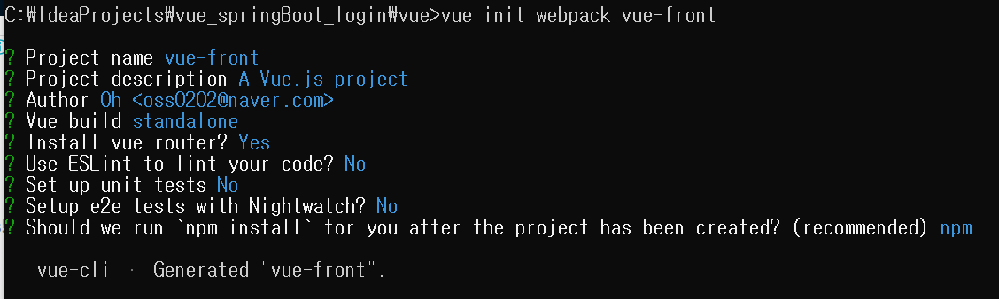
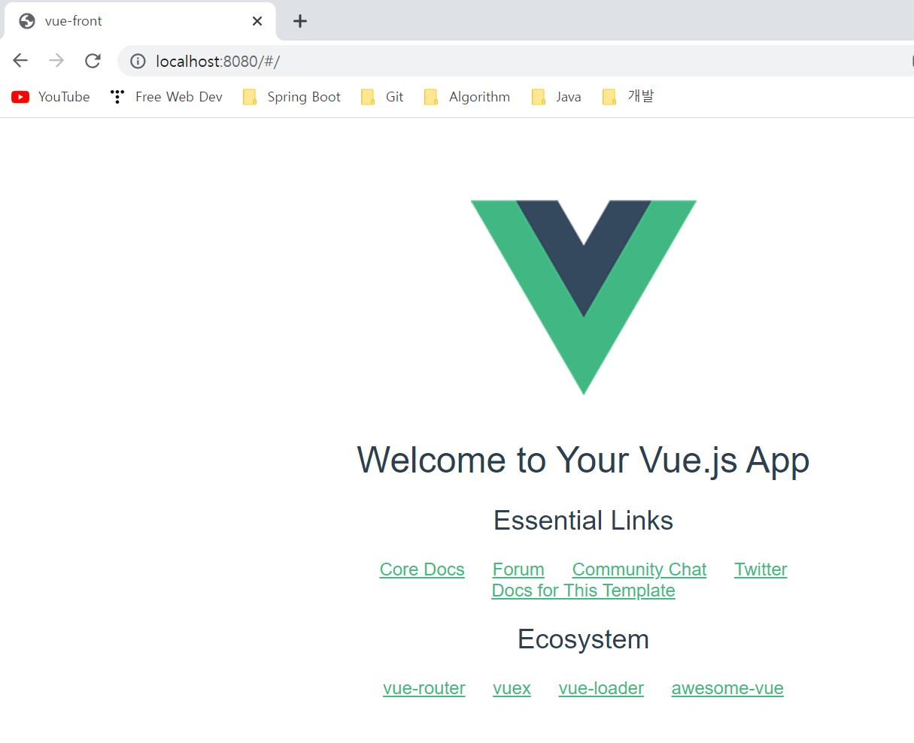

# vue_springBoot_login


1. Spring Boot 프로젝트 생성
- dependency
  - Spring web
  - Spring Data JPA
  - Lombok
  - H2 Database

2. Vue 프로젝트 생성
- Node.js 설치
  - Javascript 기반의 언어인 Vue.js를 브라우저 환경이 아닌 곳에서 빌드하고 구동시키기 위해서는 별도의 Runtime
  환경을 제공하는 Node.js를 설치해야 한다. 
  
- Vue Cli 설치
``` bash
# install vue/cli
npm i -g @vue/cli

# vue version check
vue --version
```

- vue-front 프로젝트 생성
``` bash
# vue folder create
mkdir vue

# webpack create
cd vue
vue init webpack vue-front
```


- Vue 빌드 결과 경로 수정
  - Spring Boot static 폴더
  - ****index.js (vue/vue-front/config/index.js)****
  ```js
  index: path.resolve(__dirname, '../../../src/main/resources/static/index.html'),
  ...
  assetsRoot: path.resolve(__dirname, '../../../src/main/resources/static'),
  ```
  
3. 프로젝트 빌드
- vue build
``` bash
# cd vue-front
cd vue/vue-front

# build
vue run build
```
- src/main/resources/static/ 폴더 확인
- Spring Boot run

